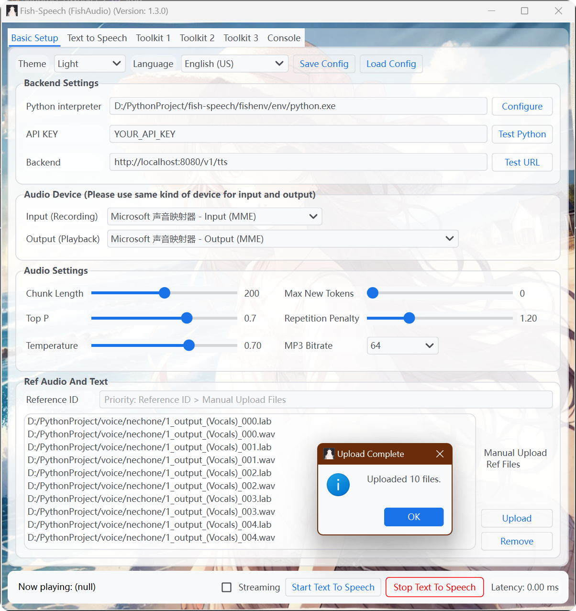
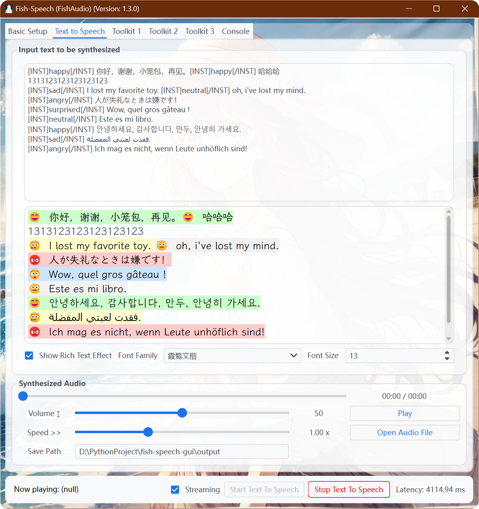
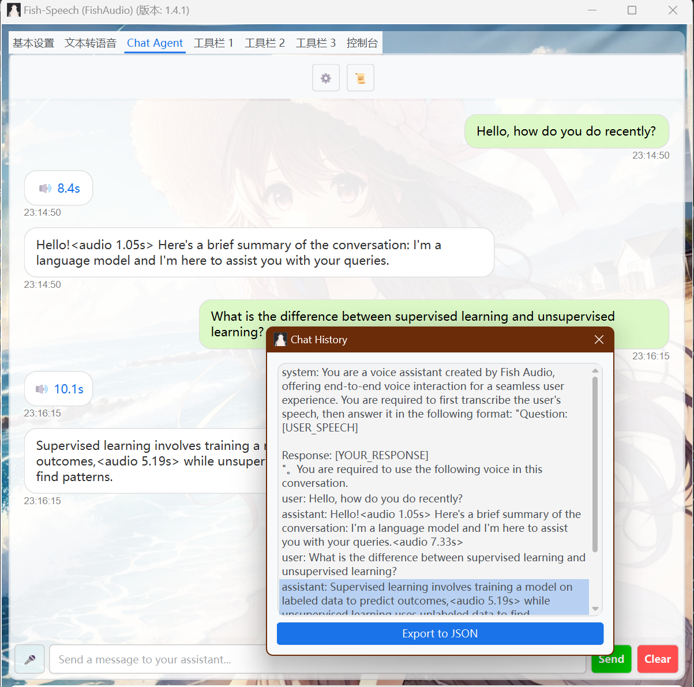

# fish-speech-gui


## Features

1. **User-Friendly API Requests** :
   <u>Easily send requests to the Fish-Speech API</u> through a clean and intuitive interface. Users can quickly set up configurations, select voice settings, and manage audio processing with minimal setup.

2. **Integrated Audio Processing Toolkits**:
   Provides essential toolkits for various audio tasks, including <u>resampling, vocal separation, and transcription</u>. These tools are seamlessly integrated, allowing for smooth workflows and efficient processing of audio files.

3. **Extensibility and Flexibility**:
   Designed with extension in mind, the GUI supports adding new features and plugins, enabling users to tailor the tool to specific needs and projects.

4. **Real-Time Monitoring and Streaming**
   Offers options for real-time audio streaming and detailed latency information, enhancing user experience for both playback and synthesis monitoring.

## Basic Setup



## Text to Speech



## Chat With Your Agent



# Build from Source

```bash
conda create -n pyqt python=3.10
conda activate pyqt
pip install pdm
pdm sync
pdm run build.py
```

# Debug

```bash
conda activate pyqt
python main.py
```

# Run

```
# windows
dist\fish.exe

# linux
dist/fish
```

## Tips

### Use FAP(Fish Audio Preprocess)

1. To install the dependencies for the **FAP Toolkit**, run the following command in this project root:

```bash
pip install -r extra-requirements.txt
```

2. Open the GUI and ensure the Python path is correctly configured to the Python environment where you ran the above command.

3. You are now ready to use the toolkit.
