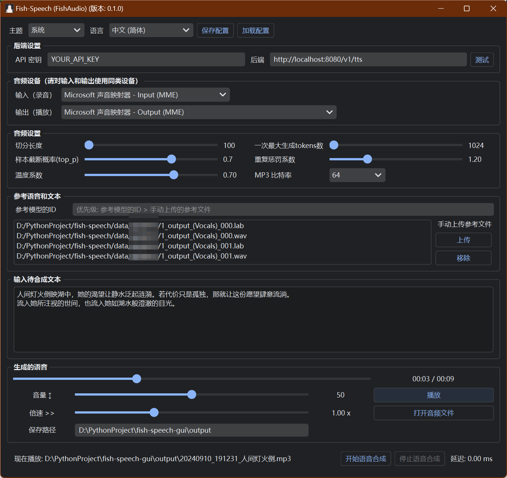

# fish-speech-gui



# Build from Source

```bash
conda create -n pyqt python=3.10
conda activate pyqt
pip install pdm
pdm install
pdm run build.py
```

# Run

```
# windows
dist\fish.exe

# linux
dist/fish
```
