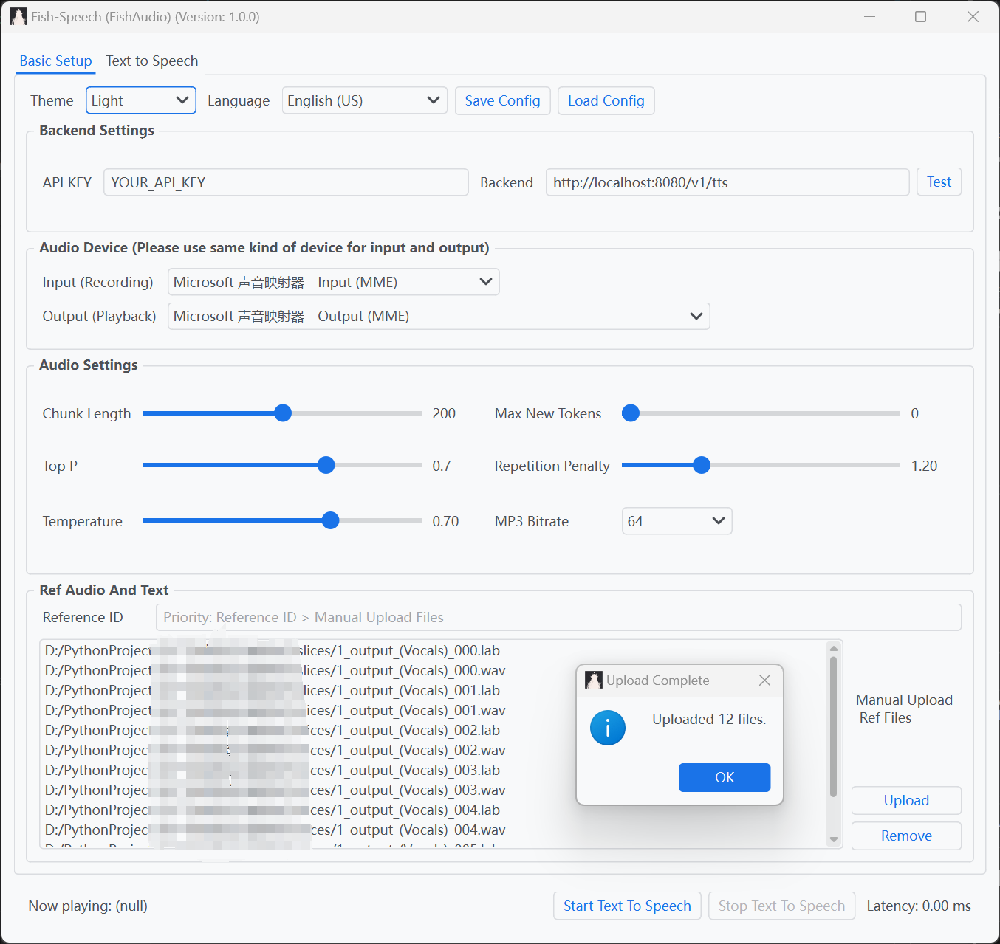
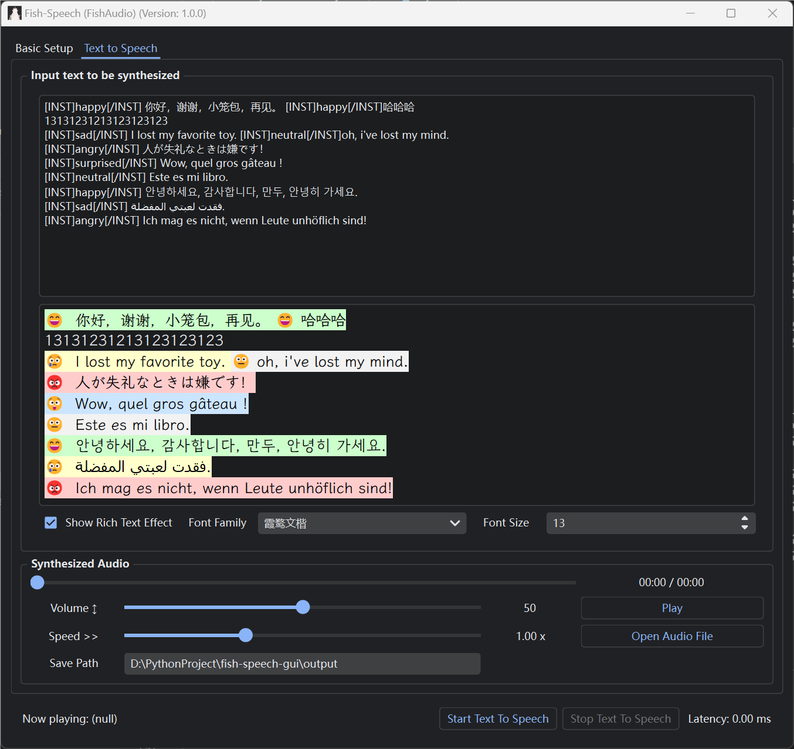

# fish-speech-gui

## Basic Setup



## Text to Speech



# Build from Source

```bash
conda create -n pyqt python=3.10
conda activate pyqt
pip install pdm
pdm install
pdm run build.py
```

# Debug

```bash
conda activate pyqt
python fish/__main__.py
```

# Run

```
# windows
dist\fish.exe

# linux
dist/fish
```
